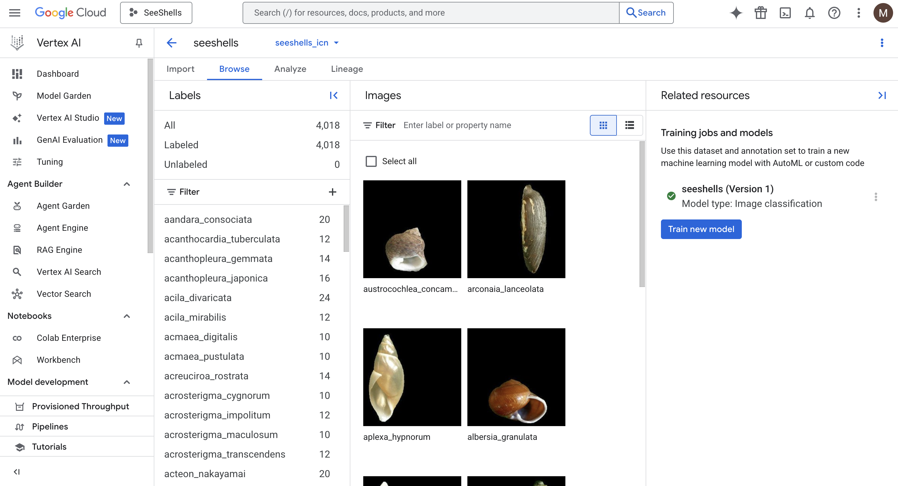
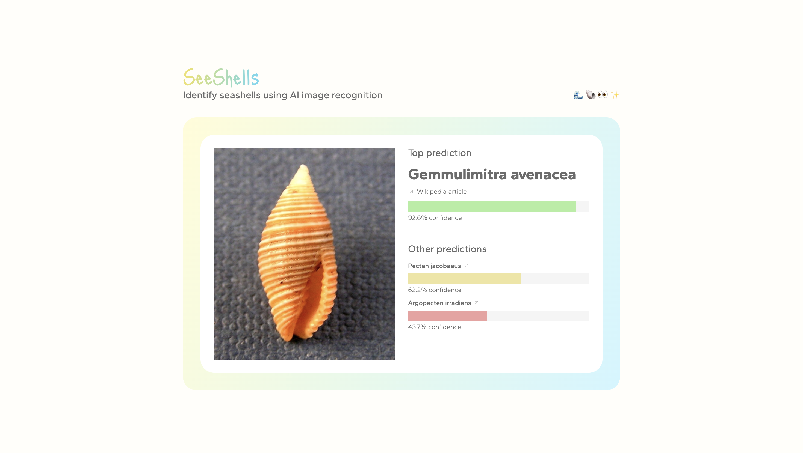

# 🐚 SeeShells

An AI-powered web app that helps users identify seashells from photos, using a custom-trained image recognition model deployed on Google Cloud Vertex AI.

   

The idea for this project came to me while I was going through my seashell collection, trying (and failing) to match each one with a guidebook full of thousands of shells. It was super slow and tedious! I figured why not just take a picture and let AI do the work?

So I decided to try building it. SeeShells started as a small side project to see if I could use AI to identify shells, while also experimenting with technologies/concepts I hadn’t worked with before but very much interested in (GCP, machine learning, and AI).

For the look of the app, I used Figma to draft up the prototype. I wanted to create something minimal but fun, so I went with custom styling. This project includes custom animations and SVG drawings.

## Links

- [Setup](./docs/SETUP.md)
    - [Model Training Guide](./docs/SETUP.md#model-training-guide)
    - [App Guide](./docs/SETUP.md#app-guide)
- [API documentaion](./docs/openapi.yml)

## Preview

<video src="https://github.com/user-attachments/assets/eb1d2042-930d-4704-ad08-b692781f12a3"></video>
> 💭 Upload an image of the seashell and see predictions for what the species is!

> ✨ Custom-trained model with Vertex AI

> 📷 Integrates with Wikipedia's API to get images of species